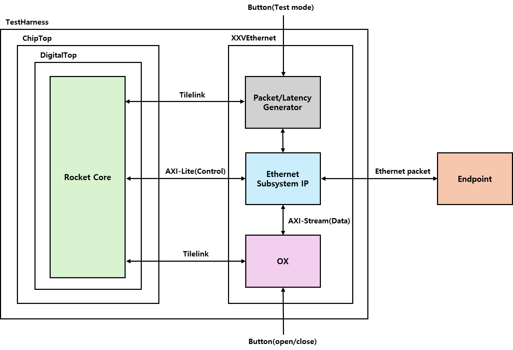

# OmniXtend - Host Node (Chisel)

10G, 100G support code for OmniXtend in Chipyard environment

## 

# 1. OmniXtend over Ethernet Subsystem  

The **OmniXtend over Ethernet Subsystem** is designed to transmit and receive OmniXtend packets using Ethernet Subsystem IP, built on the **Chipyard platform**.

## 1.1 Rocket Core  
The **Rocket Core** functions as the processor and interfaces with external components through the following buses:  
- **SystemBus**  
- **MemoryBus**  
- **FrontBus**  
- **PeripheryBus**  

## 1.2 XXVEthernet Block  
The **XXVEthernet Block** handles Ethernet-based data transmission and reception with external endpoints. It includes the following components:  
- **OX Module**  
- **Packet/Latency Generator**  
- **Ethernet Subsystem IP**  

These components work together to provide efficient communication within the subsystem.

# 2. Code Explanation  

## 2.1 ETHERNET SUBSYSTEM IP-RELATED CODE  

### 2.1.1 xxv_ethernet.scala  
The `xxv_ethernet.scala` file connects the Ethernet Subsystem IP and the OmniXtend module. To use the Ethernet Subsystem IP, I/O ports must be declared. Depending on their purpose, the I/O ports are categorized into:  
- `HasXXVEthernetPads`  
- `HasXXVEthernetMAC`  
- `HasXXVEthernetClocks`  
- `HasXXVEthernetJunk`  
- `HasXXVEthernetAXI4Lite`  

The `XXVEthernetBlackBoxIO` groups these I/O ports and uses them as the IO of the `XXVEthernetBlackBox` class.  

The `XXVEthernetBlackBox` generates the Ethernet Subsystem IP using Vivado TCL scripts.  

The `AXI4StreamFIFO` is a Xilinx IP used to handle clock domain crossing between the OmniXtend module and the Ethernet Subsystem IP. It is also generated using Vivado TCL scripts.  

The `PacketGen` is a wrapper for the Verilog code `packetgen.v`, which generates packets for throughput testing and measures throughput. It operates at 156.25 MHz, the same frequency as the Ethernet Subsystem IP.  

The `LatencyGen` is a wrapper for the Verilog code `latencygen.v`, which generates packets for latency testing. It also operates at 156.25 MHz.  

The `VIO` is a Xilinx IP that allows users to set values through Vivado’s Hardware Manager.  

The `DiplomaticXXVEthernet` creates nodes for the AXI-Lite bus and includes the `XXVEthernetBlackBox` module. The IO of the `XXVEthernetBlackBox` is connected to the IO and AXI-Lite nodes of the `DiplomaticXXVEthernet`.  

The `XXVEthernet` module integrates the `DiplomaticXXVEthernet` and the `OmniXtendNode`. It also includes Chipyard diplomatic widgets to connect the AXI-Lite node of the `DiplomaticXXVEthernet` to the TL node of the `OmniXtendNode`. To handle clock domain crossing between these nodes, the `ox2ethfifo` and `eth2oxfifo` modules utilize `AXI4StreamFIFO`.  

Finally, the `OmniXtendNode` and the `DiplomaticXXVEthernet` are connected through `ox2ethfifo` and `eth2oxfifo`.  

### 2.1.2 UltraScaleShell.scala  
The `EthernetUltraScalePlacedOverlay` in `UltraScaleShell.scala` allows the Ethernet Subsystem IP to be instantiated in the `TestHarness` (Top file). The `XXVEthernet` is instantiated, and its `overlayOutput.axi` and `overlayOutput.ox` are declared as `pcs.node` and `pcs.node2`, respectively, ensuring proper connection between the `XXVEthernet` and the `OmniXtendNode` in `TestHarness.scala`. Additionally, button inputs are passed to `pcs.module`.  

### 2.1.3 Ethernet.scala  
The `EthernetPlacedOverlayOutput` in `Ethernet.scala` defines the type of `axi` as `AXI4InwardNode` and `ox` as `TLInward`, enabling proper connections in `TestHarness.scala`.  

The `EthernetPads` are IO for the `EthernetPlacedOverlay`, with additional GPIOs declared to implement button functionality.  

### 2.1.4 TestHarness.scala  
The `TestHarness.scala` file generates the Vivado top file. To add the Ethernet Subsystem, a `refClkNode` must be created in a manner similar to the `sysClkNode`. The `refClkNode` connects to the `dclk` of the Ethernet Subsystem IP.  

The `overlayOutput.axi` and `overlayOutput.ox` declared in `EthernetUltraScalePlacedOverlay` are instantiated as `ethNode` and `oxNode`. Data buses from the Rocket Core are instantiated as `ethClient` and `oxClient`. These nodes are connected to form AXI-Lite and TL buses.  

## 2.2 OMNIXTEND MODIFIED CODE  

### 2.2.1 OX.scala  
The `OX.scala` file includes the `OmniXtendNode`, the top file for OmniXtend. To replace the simulation endpoint within OmniXtend with an actual endpoint connected via Ethernet, additional IO is declared in the `OmniXtendBundle`.  

Since the actual data processing occurs inside the transceiver, IO is passed directly to the transceiver.  

To enable Ethernet packet transmission, the `D channel` response valid signal is replaced with the valid signal of the Ethernet packet.  

### 2.2.2 PacketTransceiver.scala  
The `PacketTransceiver.scala` file converts TileLink signals into Ethernet packets. It requires IO for sending and receiving Ethernet packets, which are passed from the `OmniXtendNode`. Additionally, it generates signals like `toggle_last`, `axi_rdata`, and `axi_rxvalid` for the `D channel` response in `OmniXtend.scala`.  

When receiving RX AXI-Stream signals from the Ethernet Subsystem IP, these are converted into TileLink signals. Once converted, the `devmem read` command can be used to check the value of received data from Ethernet packets.  

Similarly, TileLink signals are converted into AXI-Stream signals with an Ethernet packet structure. Ethernet headers and payloads are generated and converted into a 64-bit AXI-Stream format.  

## 2.3 HARNESSBINDER/IOBINDER-RELATED CODE  

### 2.3.1 HarnessBinder.scala  
The `HarnessBinder.scala` file defines `HarnessBinders` to connect signals between `ChipTop` and `TestHarness`. New `HarnessBinders` must be defined to add Ethernet AXI-Lite and OX TileLink buses.  

- `WithEthernetAXI4Lite`: A `HarnessBinder` for the AXI-Lite bus, defined using `CanHaveMasterAXI4MMIOPort` and `HeterogeneousBag[AXI4Bundle]`. It connects the ports in `ChipTop` to `ethClient` in `TestHarness`.  
- `WithOXTilelink`: A `HarnessBinder` for the TileLink bus, defined using `CanHaveMasterTLMMIOPort` and `HeterogeneousBag[TLBundle]`. It connects the ports in `ChipTop` to `oxClient` in `TestHarness`.  

### 2.3.2 IOBinders.scala  
The `IOBinders.scala` file defines `IOBinders` to connect signals between `DigitalTop` and `ChipTop`. New `IOBinders` must be defined to add Ethernet AXI-Lite and OX TileLink buses.  

- `WithAXIIOPassthrough`: An `IOBinder` for the AXI-Lite bus, defined using `CanHaveMasterAXI4MMIOPort`. It creates a `HeterogeneousBag[AXI4Bundle]` IO in `ChipTop` and connects it to the system.  
- `WithOXIOPassthrough`: An `IOBinder` for the TileLink bus, defined using `CanHaveMasterTLMMIOPort`. It creates a `HeterogeneousBag[TLBundle]` IO in `ChipTop` and connects it to the system.  

### 2.3.3 Configs.scala  
The newly defined `HarnessBinder` and `IOBinder` must be added to `WithVCU118Tweaks` in `Configs.scala`. Additionally, memory regions used by the `HarnessBinder` and `IOBinder` are defined in `WithDefaultMMIOPort`.  

- `ExtBus`: Used by the Ethernet AXI-Lite bus (0x6000_0000–0x6001_0000).  
- `ExtBus2`: Used by the Memory TileLink bus (0x2_0000_0000–0x2_1000_0000).  
- `ExtBus3`: Used by the OX TileLink bus (0x1_0000_0000–0x2_0000_0000).  

### 2.3.4 Ports.scala  
The `Ports.scala` file defines the systems used in `HarnessBinder` and `IOBinder`. Parameters are adjusted to use the memory regions defined in `WithDefaultMMIOPort`.  

### 2.3.5 System.scala  
The `ChipyardSystem` in `System.scala` is updated to include the systems used in `HarnessBinder` and `IOBinder`. The `CanHaveMasterTLMMIOPort` is newly added to the `ChipyardSystem`.  

## 2.4 PACKAGE DEPENDENCY-RELATED CODE  

### 2.4.1 build.sbt  
The `build.sbt` file manages package dependencies in Chipyard. To ensure proper operation of the newly added packages, dependency modifications are required:  

- In `generators/chipyard`, add `OXHost` and `fpga_shells` to `chipyard`'s `dependsOn`.  
- In `fpga/fpga-shells`, add `OXHost` to `fpga_shells`'s `dependsOn`.  
